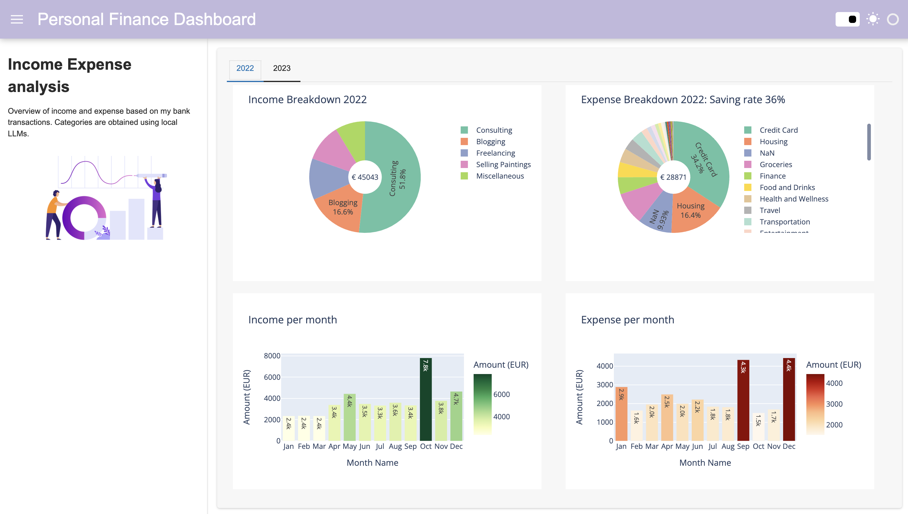

# local-llms-analyse-finance
In this project, I explored how local LLMs can be used to label data and support analyses. Specifically, I used Llama2 model to automatically categorise my bank transaction data.

## Installing local LLMs with Ollama (currently support MacOS and Linux)
https://ollama.ai/

## Tutorial video: 
https://www.youtube.com/watch?v=h_GTxRFYETY

## Personal finance dashboard:

## Disclaimer:
The example data in this repo are fictious and for illustration purposes.
